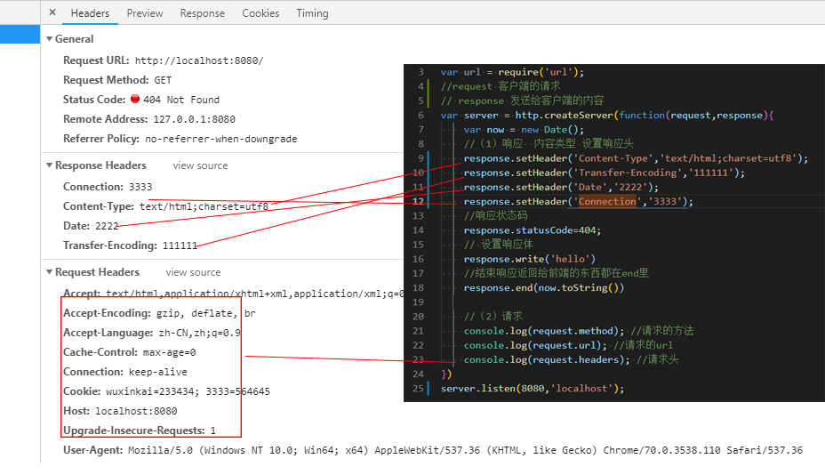

# 读写文件

### (1)同步读取 readFileSync 和 同步读取 readFil

```
  fs.readFile('./a.js', 'utf8', function (err, data) {
    console.log(data)
  })

  fs.readFileSync('./a.js', 'utf8', function (err, data) {
    console.log(data)
  })

  // 在 PS E:\A学习盘\node2\自己写的node教程\4.读写文件> node read.js  输出结果
```

### (2)解决异步获取内容的方法

```
let person = {}
function show() {
  if (Object.keys(person).length ==2) {
    console.log(person);
  }
}

fs.readFile('./a.js', 'utf8', function (err,data) {
  person.name = data;
  show()
})

fs.readFile('./b.js', 'utf8', function (err,data) {
  person.age = data;
  show()
})
```

### (3)同步写入 writeFileSync 和 异步写入 writeFile

flag 是表示 w 是清空并写入 a 在原有基础上追加

```
fs.writeFile('写入的路径', '写入的内容','utf8',{flag:w}, function () { })

fs.writeFileSync('写入的路径', '写入的内容','utf8',{flag:a}, function () { })

//追加内容
fs.appendFile('./a.js', '写入的内容','utf8', function () { })
```

### 读出内容写入另一个 js 中

```
var  fs =require('fs');
function cope(src,tarage){
  fs.readFile(src,'utf8',function(err,data){
    fs.writeFile(tarage,data,'utf8',function(){
      console.log('读取成功')
    })
  })
}
cope('./a.js','./b.js')
```

### 读写图片

```
var fs = require('fs');

function copy(src, target) {
    //读文件     如果是图片就不能用utf8' ,用binary  不知道就不用写
    fs.readFile(src, 'binary', function (err, data) {
        fs.writeFile(target, data,'binary', function (err) {
            console.log("把" + src + "复制到" + target)
        })
    })
}
copy("./zt.png", "./zt2.png");


在node执行 \node2\自己写的node教程\4.读写文件> node img.js
```

# 读写目录

### 1 创建目录

```
fs.mkdir('text2',function(err){
    if(err){
        console.log('创建失败')
    }else {
        console.log('创建成功')
    }
});

执行 A学习盘\node2\自己写的node教程\5.读写目录> node 目录.js
```

### 2 读取目录下所有的文件

```
fs.readdir('./book',function(err,files){
    console.log(files)
})
```

### 3 读取一个文件或目录详情

```
fs.readdir('./book',function(err,files){
    //循环文件列表
   files.forEach(function(file){
       //获取文件详情
       fs.stat('./book/'+file,function(err,state){
            console.log(state.atime) //mtime atime birthtime ctime  都是时间
            console.log(state.size) //2 常用的
            console.log(state.isDirectory()) //2 是不是目录
            console.log(state.isFile()) //2 是不是文件
       })
   })
})
```

### 4 判断文件是否存在

```
fs.exists('./book',function(exists){
    console.log(exists)
})
```

### 路径拼接

```
//处理路径
console.log(path.join('./book','mysql.json ')) //合并路径

console.log(path.sep) //分割路径

console.log(__filename) //获取当前的模块的绝对路径

console.log(__dirname) //获取当前模块所在的绝对目录

console.log(path.basename('node.json','json')) //获取文件名

console.log(path.extname('node.json')) //获取一个路径里文件扩展名

//从一个相对路径解析一个绝对路径， 以应用程序的目录为跟起点
 console.log(path.resolve('book','node.json'))
```

# 写一个 http 服务

```
var http =require('http');
var fs =require('fs');
var url = require('url');
//request 客户端的请求
// response 发送给客户端的内容
var server = http.createServer(function(request,response){
  var now = new Date();
  //（1）响应  内容类型 设置响应头
  response.setHeader('Content-Type','text/html;charset=utf8');
  //响应状态码
  response.statusCode=404;
  // 设置响应体
  response.write('hello')
  //结束响应返回给前端的东西都在end里
  response.end(now.toString())

  //（2）请求
  console.log(request.method); //请求的方法
  console.log(request.url); //请求的url
  console.log(request.headers); //请求头
})
server.listen(8080,'localhost');

启动项目 ：自己写的node教程\6.起一个标准的服务器> node server.js
```



# ajax 发送步骤

- 0 未初始化 对象建立 尚未初始化 尚未调用 open 方法
- 1 初始化 对象建立 尚未调用 send 方法
- 2 发送数据 send 调用 但是当前的状态 http 头未知
- 3 数据传送中 已接收部分数据
- 4 xhr.readyState = 4 完成 数据接收完成 responseBody 和 responseText 获取完整的应用数据

```
  //（1）创建ajax对象
  var xhr = new XMLHttpRequest();

  //（2）指定参数， 发送地址/clock
  xhr.open('POST', '/clock', true);

  //（4）注册状态后回调函数
  xhr.onreadystatechange = function () {
    //当前状态和响应完毕
    if (xhr.readyState = 4 && xhr.status == 200) {
      document.querySelector('#box').innerHTML = xhr.responseText
    } else {
      document.querySelector('#box').innerHTML = xhr.statusText
    }
  }

  //（3）发送数据，
  xhr.send(JSON.stringify(user))
```

## 接收服务器响应 三部

- xhr.status 成功 200
- statusText 表示 http 的响应状态码描述符
- responseText 表示响应体

# 后台接收 前端发过来的数据

- on 接收 data 和 end
- 对象和字符串的转化 data.toString(); 和 JSON.parse(str)
- SON 通常用于与服务端交换数据。在向服务器发送数据时一般是字符串

```
else if(url=='/clock'){
  //返回给前台一个时间
  var str = '';
  request.on('data', function (data) {
    //转为字符串
    str += data.toString();
  })
  request.on('end', function () {
    console.log(str);
    //转成对象
    users.push( JSON.parse(str))
      response.end(JSON.stringify(users))
    })
  }
```

# 读取 get 请求的本地内容

```
 window.onload=function(){
    document.querySelector('#regBtn').addEventListener('click',function(){
      var xhr = new XMLHttpRequest();
      //发出请求
      xhr.open("GET",'./book.json',true) ; //请求方式  路径    是否异步
      //发送的是表单格式
      // xhr.setRequestHeader('Content-Type','application/x-www-form-urlencoded')
      xhr.setRequestHeader('Content-Type','11111')

      // xhr.responseType="text"; //将字符串转为对象

      //注册回调函数
      xhr.onreadystatechange=function(){
        if(xhr.readyState==4&&/2\d{2}/.test(xhr.status)){
          //获取所以的响应头
          console.log(xhr.getAllResponseHeaders())
          //获取指定的响应头
          console.log(xhr.getResponseHeader('Content-Type'))
          //获取 响应体
          console.log(xhr.responseText)
          //获取状态描述
          console.log(xhr.statusText)
          document.getElementById("box").innerHTML = xhr.responseText
        }
      }
      xhr.send()
    })
}

通过http-server 启动服务，打开 http://127.0.0.1:8080 再点击打开
```

# 上传 json 数据

- application/json 发送的是 json 类型,

```
  function toJson(form) {
    var elements = Array.prototype.slice.call(form.elements); //转换成数组
    var data = {};
    elements.forEach(function (element) {
      //先取出元素的类型
      var type = element.type;
      switch (type) {
        case 'submit':
        case 'cancel':
        case 'reset':
          break;
        case 'text': data[element.name] = element.value;
          break;
        case 'password': data[element.name] = element.value;

      }
    });
    return data
  }

  window.onload = function () {
    document.querySelector('#regBtn').addEventListener('click', function () {
      var xhr = new XMLHttpRequest();
      //发出POST请求
      xhr.open("POST", './reg', true); //请求方式  路径    是否异步

      //发送类型
      xhr.setRequestHeader('Content-Type', 'application/json');
      xhr.responseType = "text"; //将字符串转为对象
      //注册回调函数
      xhr.onreadystatechange = function () {
        if (xhr.readyState == 4 && /2\d{2}/.test(xhr.status)) {
          document.getElementById("box").innerHTML =xhr.responseText
          console.log(xhr.responseText)
        }
      };

      var data = toJson(document.querySelector('form'))
      console.log(data);
      xhr.send(JSON.stringify(data)); //发送的请求头内容，
      return false
    })
  }

```

# json 后台接收,

- 表单接收和 json 接收格式

```
 req.on('end', function (data) {
     //取出请求头的内容类型
     var contentType=req.headers['content-type'];
     //(1)application/x-www-form-urlencoded 序列化表单 查询字符串都用这个
     if(contentType=='application/x-www-form-urlencoded'){
         var obj = querystring.parse(result);
         console.log(obj);
         //json字符串
     }else if(contentType=='application/json'){  //(2)json格式
         var obj = JSON.parse(result);
         console.log(obj)
     }

     res.end('ok')
 })
```

# 上传表单格式

```
  function serialize(form){
      var elements=Array.prototype.slice.call(form.elements);  //转换成数组
      var data=[];
      elements.forEach(function(element){
          //先取出元素的类型
          var type = element.type;
          switch (type){
              case 'submit':
              case 'cancel':
              case 'reset':
                  break;
              case 'text':
                  data.push(element.name+'='+element.value )
          }
      });
      return data.join('&')
  }

  window.onload=function(){
    document.querySelector('#regBtn').addEventListener('click',function(){
        var xhr = new XMLHttpRequest();
        //发出请求
        xhr.open("POST",'./reg',true) ; //请求方式  路径    是否异步
        xhr.setRequestHeader('Content-Type','application/x-www-form-urlencoded')
//
        xhr.responseType="text"; //将字符串转为对象
        //注册回调函数
        xhr.onreadystatechange=function(){
            if(xhr.readyState==4&&/2\d{2}/.test(xhr.status)){
                console.log(xhr.responseText)
            }
        }
        //把表单的值转成查询字符串
        var data =serialize(document.querySelector('form'));  //发送的是表单
        //把数据放在请求头里发送给服务器
          console.log(data)
        xhr.send(data)  //发送的是表
    })
}

//接收的是表单格式
  req.on('end', function (data) {
      //取出请求头的内容类型
      var contentType=req.headers['content-type'];
      //(1)application/x-www-form-urlencoded 序列化表单 查询字符串都用这个
      if(contentType=='application/x-www-form-urlencoded'){
          var obj = querystring.parse(result);
          console.log(obj);
          //json字符串
      }
      res.end('ok')
  })

```

# 图片格式

- form 标签改成 enctype="multipart/form-data"
- var formData = new FormData(); //h5 新增上传图片
- 通过 var formidable= require('formidable'); 接收内容 安装 npm i formidable

## 上传图片的 html 代码

- （1）读取图片信息
- （2）把图片返回给浏览器
- （3）浏览器构建一个 img 元素 追加到 body

```
 window.onload=function(){
        //（1）注册监听
        document.querySelector('#regBtn').addEventListener('click',function(){
            var xhr = new XMLHttpRequest();
            //发出请求
            xhr.open("POST",'./reg2',true) ; //请求方式  路径    是否异步
            //(3)设置响应类型
            xhr.responseType="text"; //将字符串转为对象
            //注册回调函数
            xhr.onreadystatechange=function(){
                if(xhr.readyState==4&&/2\d{2}/.test(xhr.status)){
                  var img = document.createElement('img');
                  img.src = xhr.responseText;
                  document.getElementById("imgGrid").appendChild(img)
                    console.log(xhr.responseText)
                }
            };
            //（4）准备发射服务器的数据
            var formData = new FormData(); //h5新增上传图片
            //对象的表单元素 都是普通元素
            formData.append('username',document.querySelector('input[name=username]').value);
            //对象的表单元素 都是普通元素
            formData.append('password',document.querySelector('input[name=password]').value);
            // 这是文件元素
            var avatar =document.querySelector('input[name=avatar]');
            formData.append('avatar',avatar.files[0]);//files[0] 表示第一个元素，这个是可以多选的
            xhr.send(formData);//发送的请求头内容，
            return false
        })
    }
```

# 上传图片的 后台代码

```
if (pathname == '/reg2') {
    //创建解析器 用来解析请求体  把非file的input放在filede里 把文件类型的元素放在filede里
  var form = new formidable.IncomingForm();
  //  fields普通的input元素， files图片信息
  form.parse(req, function (err, fields, files) {
    fs.readFile(files.avatar.path, 'binary', function (err, data) {
      var filename = './imgs/' + files.avatar.name;
      fs.writeFile(filename, data, 'binary', function (err) {
        res.writeHead(200, {
          'Content-type': 'text/plain'
        })
        res.end(filename)
      })
    })
}
```

# 可读流

```
var fs = require('fs');
var rs = fs.createReadStream('./index.txt',{
  start:3,
  end:8,
  highWaterMark:1 //读取多少字节  分两次传输
});
rs.setEncoding('utf8') //转译编码
rs.on('data',function(data){
  rs.pause(); //停止喂
  setTimeout(function(){  //主要是控制生产数量和消费数量
      console.log(data)
      rs.resume() //继续喂
  },1000)
})

rs.on('end',function(){ //数据得到完成
    console.log('end')
});

rs.on('error',function(err){ //在流里判断错误 监听 error事件
    console.error(err)
});
```

# 可写流

```
var fs = require('fs');
// ../box/write.txt 父目录必须存在，不存在就会报错
var ws = fs.createWriteStream('./write.txt',{  //没有的话自己会创建
    flags:'a', //表示不清空 原来的文件  向尾部追加
    start:12, //四个汉字 所以是12，开始写入的位置
});
//写入
ws.write("，写",'utf8',function(){
    console.log(arguments)
});
ws.write("入",'utf8',function(){
    console.log(arguments)
});
//写入关闭
ws.end("内容",'utf8');
```

# 读写的 pipe.js

```
var fs = require('fs')
function copy(src,target){
  var rs = fs.createReadStream(src);
  var ws = fs.createWriteStream(target);
  //对文件操作 写和读的时候
  //要先打开文件 然后读写文件  关闭文件
  // 将数据的 带留量 限制到一个可接受的水平 可以是不同的速度的来源和目标不会淹没 可用内容
    rs.pipe(ws);
   //rs.pipe(ws,{end:false}); //end为true时表示数据读取完毕后立刻将缓存区中的数据写入目标，并关闭文件
}

copy('./index.js','./write.txt');
```

#跨域资源共享
设置响应头

```
  res.setHeader('Access-Control-Allow-Origin','http://localhost:8081')
```

# express

## 安装 npm install express --save

## 路由 根据请求路径来处理客户端发出的 GET 请求

```
app.get('/',function(req,res){
    //send他可以自动判断数据类型 ，自动转换详细信息 自动设置Content—Type
    res.send("你好 啊")
});
```

## 中间件

```
//指定路径
app.use('hello',function(req,res,next){})

//所以的路径
app.use(function(req,res,next){
    res.mny=100;
    next() //必须写next 否则下面无法执行
})
```

接收参数 http://localhost:3000/hello?name=123

```
 app.get('/hello', function (req, res) {
     console.log( req.host);//返回主机名不包括端口号
   console.log( req.path); //返回url路径名，
   console.log( req.query);//获取客户端的get请求查询字符串转成对象，
   console.log( req.params); //是一个有路径参数组成的对象
    //send他可以自动判断数据类型 ，自动转换详细信息 自动设置Content—Type
    // res.send("get hello 啊")
});
```

路径参数 http://localhost:3000/hello/23/100

```
app.get('/hello/:id/:age',function(req,res){
    console.log(req.params.id)
    console.log(req.params.age)
    res.send("post hello 啊")
});
```

## 模板：渲染模板引起

```
npm install ejs --save

var express = require('express');
var path = require('path');
var app = express();

//配置模板 属性
app.set('view engine','ejs');

//path.resolve 选获取绝对路径  然后拼拼上后的参数
app.set('views',path.resolve('views'));

//设置css样式
app.use(express.static(path.resolve('public')));

app.get('/', function (req, res) {
    //渲染模板  渲染路径   数据源
    res.render('index',{title:'首页',books:{
        name:'wuxinkai'
    }})
});

app.get('/reg', function (req, res) {

    res.render('index',{title:'注册',books:{
        name:'wuxinkai'
    }})
});
app.listen(8080);
```

## post 请求

安装接收参数的插件

```
var bodyParser = require('body-parser');

//都是把请求体对象加到 req.body上 username=11&password=222->{username:11,password:222}
app.use(bodyParser.urlencoded({extended:true}));
app.use(bodyParser.json());

app.post('/signup',function(req,res){
    //获取参数
    var user = req.body;

   req.session.error = '此用户名已经被占用，请换个新的试试吧';
   res.redirect('/signup');// 重定向 让客户端重新访问指定路径
});
```

# cookie

下载

```
 cnpm install cookie-parser
```

后台设置 http://localhost:8080/write

```
if(req.url=='/write'){
    res.setHeader('Set-Cookie','name=wuxinkai');
    res.end('ok ')
}
```

获取 cookie http://localhost:8080/read\
```
if(req.url=='/read'){
  console.log(req.headers);
  //获取cookie
  res.end(req.headers.cookie);
}
```
# session
安装
```
cnpm install express-session
```
